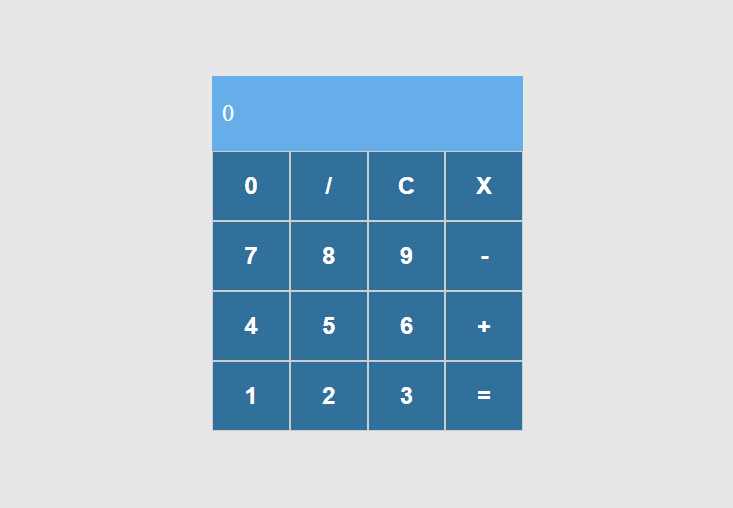

# O projeto ✨

Este projeto foi desenvolvido como parte da "Formação React Developer" da Dio. 
Ele consiste em uma calculadora que realiza as operações básicas de adição, subtração, multiplicação e divisão. 
Para a implementação, foram utilizados o React e o styled-components.

Confira abaixo o resultado final do projeto: 

## Comandos 🧙‍♂️

Para instalar as dependências do projeto basta digitar o comando abaixo no terminal:

`$ npm install`

Para iniciar o projeto basta digitar o comando abaixo no terminal:

`$ npm run start`

## Dependências ⚙

**React:** uma biblioteca JavaScript de código aberto amplamente utilizada para criar interfaces de usuário interativas e escaláveis. Ele permite construir componentes reutilizáveis e renderizá-los de forma eficiente no navegador.
Para iniciar um projeto com React basta digitar o comando abaixo no terminal:

`$ npx create-react-app (nome do projeto)`

**Styled-components:** uma biblioteca JavaScript que permite escrever estilos CSS em componentes React usando uma sintaxe semelhante ao CSS, mas diretamente no JavaScript. Em vez de criar arquivos separados de estilos CSS, o styled-components permite escrever os estilos diretamente nos componentes React, tornando o código mais coeso e facilitando a criação de componentes estilizados.
Para instalar o styled-components basta digitar o comando abaixo no terminal:

`$ npm i styled-components`